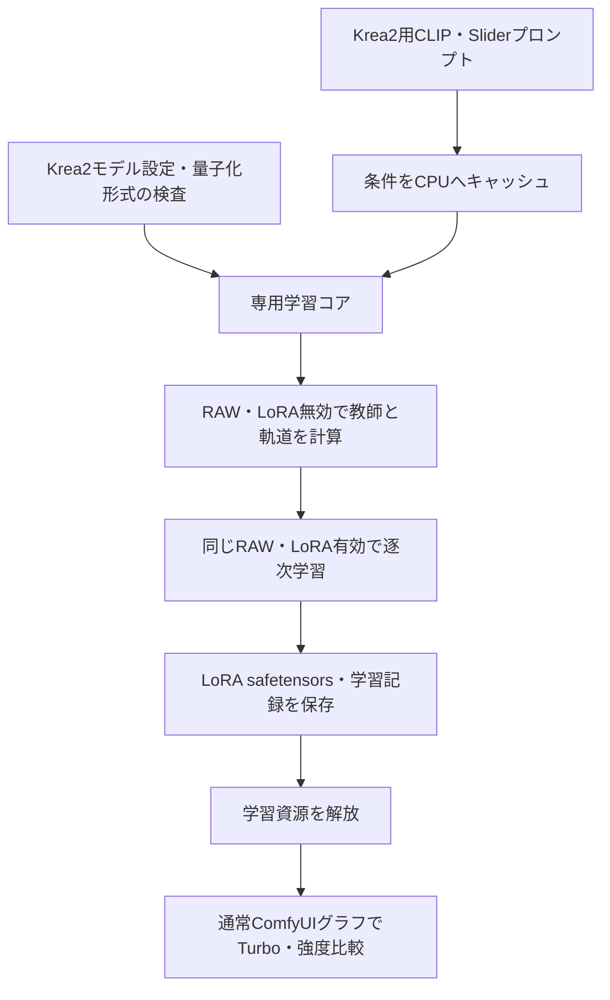

# Krea2 Concept Slider LoRA：16GB・AMD/NVIDIA対応 実装計画

作成日：2026-09-27。状態：調査・設計完了、実装および実モデルでの学習検証は未実施。

実装追記（2026-09-27）：承認後にP0〜P5を実装し、R9700で実プロンプト100step、ComfyUI API実行、保存・キャンセル・再実行を検証した。NVIDIA／物理16GB／Linux／Turbo画質の受け入れ条件は未達（未検証）。最新状況は [実装進捗](../../docs/implementation-progress.md) と [検証記録](../../docs/validation.md) を参照。以下は計画作成時点の設計を保持している。

## 1. 結論と実装範囲

**推奨構成は、Krea2 RAWの凍結重みをConvRot INT8で保持し、BF16/FP16で演算、LoRAだけを学習する専用バックエンドである。CPUへのブロック退避、勾配チェックポイント、テキスト条件の事前キャッシュを併用する。**

Musubi TunerのKrea2学習実装をモデル・量子化・退避の主な参考にし、既存Anima/Mage FlowノードからSlider損失、プロンプト管理、LoRAの有効・無効切替、進捗・保存処理を移植する。既存ノード全体のコピーや外部トレーナーCLIのラッパー化は採用しない。根拠は後述のL1〜L8、U1〜U5。

AMD/NVIDIAの共通基準は**INT8保存＋PyTorchによる一時的な逆量子化＋微分可能な浮動小数点演算**とする。高速INT8カーネルは、GPU・OS・PyTorchの組合せごとにforward/backward試験を通過した場合に選べる追加経路とする。INT8保存とINT8演算は別の設定・検証項目として扱う。

16GB対応は達成目標であり、現段階の動作保証ではない。パラメータ集計では重みだけでも約12GiB以上になるため、INT8化だけで収まるとは判断できない。最初にCLI相当の小さな検証入口で学習ステップの勾配とピークVRAMを確かめ、その後にノードを完成させる。

要件と前提：

- ComfyUI内でテキストによるConcept Slider LoRAを学習し、通常のLoRAとして保存・使用できる。
- 学習はRAW、主な利用・品質評価はTurbo。公式もこの組合せを推奨している。[U1]
- 16GBカードで、準備・学習・評価・保存を含めてOOMを起こさない設定を提供する。
- Windowsを優先し、NVIDIA CUDA／AMD ROCmそれぞれに同一の機能契約を用意する。Linuxも別の検証行として扱う。
- メインメモリ容量、最低速度、対象GPU型番は未指定。64GiB RAMを初期推奨案とし、32GiBはストリーミング読込・事前量子化済み重みで別途評価する。これは計測済み要件ではない。
- 初期リリースは単一GPU、テキストSlider、標準LoRA、AdamW。画像対学習、LoKr、複数GPU、QPOLA、学習中のTurbo同時常駐は後続対象。
- ソースを新規実装する場合も、現在のフォルダー名 `Confyui-krea2-slider-node` は維持する。

## 2. 確認できた実装・環境

対象ルートには調査開始時点で実装用のPythonパッケージやルートGitリポジトリがなく、主に `参考/krea-2` と `参考/sd-scripts` が存在する。

| 調査対象 | リビジョン | 確認内容 |
|---|---|---|
| ローカルKrea2公式参照 | `db3984fbc6e13b34c0064990fc2d95ac64d00058` | 28ブロック、幅6144、GQA 48/12、Qwen3-VL-4B、12層のテキスト特徴。[L1,L2] |
| ローカルsd-scripts | `690ea7f96c23182352ec63def76d431c6120bd2f` | FP8逆量子化Linear、backward対応block swap。検索範囲のPython/MarkdownにKrea2専用実装は見つからない。[L3,L4] |
| 既存Anima Slider | `fe3dc33bb0f19878106bc43e96b32066019ebfa3` | 共通Slider損失・LoRA操作・V3ノード・AdamW。GPU全体ロードはKrea2向けに変更が必要。[L5,L6] |
| ローカルComfyUI | `15ef24d1c0333a3eba56c5cd153d8db65363ff8f` | Krea2モデル・テキストエンコーダー・LoRA対応が存在。[L7,L8] |
| GitHub Musubi Tuner | `4e7c7149249e7715e9168920feb4c420423abba7`、コミット日2026-09-16 | Krea2、ConvRot INT8、独自backward、prequantized読込、checkpoint・退避の実装とテストを取得。[U2〜U5] |

リビジョンは識別用で、作業ツリーが完全に未変更であることまでは検証していない。ローカルファイル本文と行番号を実際の根拠とする。

このセッションで `C:/ComfyUI/.venv/Scripts/python.exe` から検出した環境：

- `torch 2.12.0+rocm7.14.0`、`torch.version.hip=7.14.60850`。
- GPU：AMD Radeon AI PRO R9700、報告VRAM 31.859375GiB。
- NVIDIA実機の検証結果はない。メインメモリ容量は未確認。
- GPU検出とmetaデバイスでの構造集計のみ実施。実重みのロード・GPU学習・画質評価は行っていない。

## 3. VRAMの見積もりと予算

公式の `inference.py:12` の構成を `mmdit.py` のmetaモデルに与えて集計した。モデル重みのダウンロードや巨大な実メモリ確保は不要な方法である。[L1]

| 項目 | 集計値／理論値 |
|---|---:|
| DiT総パラメータ | 12,820,073,036 |
| 28個のメインブロックのパラメータ | 12,156,476,416 |
| 全体BF16、2byte/param | 23.879GiB |
| 全体を理想的に1byte/paramと仮定 | 11.940GiB |
| メインブロック1byte、残り2byteとする概算 | 12.558GiB |
| メインブロック1個、BF16／8bit概算 | 0.809／0.404GiB |
| 全264 Linearにrank 8を付けたLoRA | 29,326,440 params |
| 主ブロックattention 140 Linear、rank 8 | 11,698,176 params |

8bit概算はscale、量子化しないnorm、FP32パラメータ、アロケータ、activation、作業領域を除く。実メモリ使用量ではない。FP32 LoRAの重み・勾配・AdamWの2状態を16byte/paramで概算すると、attention/rank 8は約0.174GiB、全Linear/rank 8は約0.437GiB。optimizerの一時領域は別に必要となる。

8ブロックを退避すると主重みは概算約9.32GiB、12ブロックなら約7.71GiBになる。ただし二重バッファ、一時的な逆量子化重み、backwardの滞留を含まないため、この計算だけでswap数を確定しない。

初期予算案：

| 用途 | 目安 |
|---|---:|
| GPU常駐ベース重み | 7.5〜9.5GiB |
| activation・再計算・勾配・attention作業領域 | 2〜3GiBを目標、実測で修正 |
| LoRA・optimizer | 0.2〜0.5GiB程度から開始 |
| 逆量子化・転送・allocator余白 | 1〜2GiBを目標、実測で修正 |

**運用目標は学習プロセスの予約メモリ14GiB以下かつ実際のデバイス空き容量内。** 表の上限を足して保証値にしない。OS・表示・他アプリが使う分を起動時に測り、必要な余白を差し引く。16GBという製品表示は固定16GiBの割当保証として扱わない。

全工程で `max_memory_allocated` / `max_memory_reserved`、`mem_get_info`、利用可能ならベンダー側のデバイス使用量、CPU RSS、秒/stepを記録する。初回ロード・量子化・warm-up・backward・optimizer初期化・保存時も測る。

32GBのR9700では16GB相当のソフト上限試験を先行できるが、PyTorch allocatorの制限ではドライバー領域や物理的な16GBカードの挙動を再現できない。正式な16GB対応判定には実16GBカードが必要。

## 4. 調査した方式の比較

| 方式 | 利点 | 制約／今回の扱い |
|---|---|---|
| ConvRot INT8＋浮動小数点backward | Krea2専用学習実装とテストがある。ComfyUI形式の量子化済み重みも参考になる。[U2〜U4] | 第一候補。共通PyTorch経路を先に検証し、Triton/HIP等は能力判定付きで追加する。 |
| scaled FP8保存＋BF16逆量子化 | sd-scripts・Musubiに既存実装があり比較基準に使える。[L3,U5] | 代替候補。scale付きLinearのみを対象にし、normを一括FP8化しない。GPUでのFP8変換・演算可否を個別試験する。 |
| TorchAO INT8 weight-only | SimpleTunerにKrea2 LoRA例がある。[U6] | 第二候補。Tensor subclass、保存形式、退避・backwardの組合せを検証してから採用。 |
| bitsandbytes NF4/INT8 | 4bitなら重み容量をさらに削減できる。現行資料にはAMD ROCm対応の説明もある。[U7] | 後続候補。現在の対応資料を使い、AMD非対応とは断定しない。対象wheel・GPU・OSで検証し、ComfyUI形式との変換も設計する。 |
| optimum-quanto | 学習・freeze・量子化マップの仕組みがある。[U8] | 既存スタックとの互換性が必要な場合の代替。初期依存は増やさない。 |
| BF16＋大量のCPU退避 | 量子化誤差がなく小さな比較試験の基準になる | RAM・PCIe転送量が大きい。通常の16GBプリセットにはしない。 |

SimpleTunerの公開H100測定は、INT8でも512/batch 1で18.10GiB、1024/batch 1で20.35GiB。別トレーナー・別rank等の結果であり本実装の必要量には転用しないが、「INT8だけで16GBを保証できない」根拠になる。[U6]

設計案は次の3つを比較した。

1. **専用学習コア＋ComfyUI V3ノード：採用。** 凍結重み・autograd・退避の所有権を明確にでき、Slider固有の逐次教師計算を組める。
2. ComfyUIの推論用MODELを直接改造：既存ノードに近いが、推論専用kernel、共有ModelPatcher、動的VRAMとの競合が大きい。初期版では避ける。[L5,L7]
3. Musubi/AI Toolkit/SimpleTunerを外部ジョブとして起動：通常LoRAでは有用だが、Slider損失の追加とComfyUIの停止・保存連携が結局必要。参考実装として利用する。[U2,U6,U9]

## 5. 推奨アーキテクチャ



### モデル読込と所有権

- 設定ノードはファイル名・形式・予算を持つ軽量設定を返す。巨大なMODELを先にロードしない。
- 学習コアがRAWの1コピーだけを所有する。teacher/studentは同じベースを使い、LoRAの乗数を0／±1に切り替える。
- meta初期化とテンソル単位の読込を行い、CPUでの量子化または事前量子化済み重みから組み立てる。BF16モデル全体をGPUに載せてから量子化する経路を作らない。[U4]
- frozen base、LoRA、optimizer、scale等のbufferを区別する。退避対象は凍結ベースのみとし、LoRAとoptimizer stateは位置を固定する。
- ComfyUI管理下のCLIP/VAE/推論モデルは必要な段階で退避・解放してもらい、学習中に推論用の動的VRAMと独自offloaderを同じ重みに適用しない。
- 共有ModelPatcherのcloneを重みの独立コピーだと仮定しない。既存ワークフローのMODELやglobal kernel設定を変更しない。

### 量子化とautograd

- `quantization = convrot_int8 | fp8_scaled | bf16_reference`、`linear_backend = eager | verified_fast` を内部で分離する。初期UIは自動選択と診断結果で十分。
- 未量子化RAWと、認識済みComfyUI ConvRot INT8 RAWを入力対象にする。`comfy_quant`、weight dtype、scale、group size、各層shapeを検査する。[U3,U4]
- 任意のINT8、FP8、GGUF、NF4を同一形式として扱わない。未対応形式は明確に拒否し、破損・不完全なmetadataを黙って補わない。
- ConvRotのLoRA枝には回転前の入力を渡す。ベースは回転したINT8重みで保持し、backwardでは入力勾配を元の座標系へ戻す。[U3]
- **ベースが凍結されていても、学生forward全体をno_gradにしてはいけない。** 前段LoRAへ勾配を伝えるため、ベースLinearの入力勾配は必要。
- 独自autogradは量子化重みとscaleのみを保持し、BF16復元重みを全層分backwardまで残さない。復元は必要なLinearごとに一時的に行う。[U3]
- 初期版のbackwardは浮動小数点のみ。INT8 backwardは品質・速度の比較結果が得られた後の候補。
- ROCmでも `device.type == 'cuda'` になり得る。NVIDIA判定には `torch.version.cuda`、AMD判定には `torch.version.hip` を使う。Musubiの `HAS_TRITON and x.is_cuda` だけをそのまま能力判定にしない。[U3,L6]
- BF16 GEMM・SDPA backwardが試験に失敗する環境ではFP16＋GradScalerを独立プリセットとして検証する。黙ってFP32へ切り替えて予算を超えない。

### 退避・checkpoint

- まず同期転送を含む単純なスケジュールで正しさを固定し、非同期prefetchはその後に入れる。
- 主ブロック単位に `checkpoint(..., use_reentrant=False)` を使用する。教師no_grad実行と学生training実行のそれぞれでoffloaderを正しい状態に戻す。[U5]
- CPUへ送る重みだけでなく、scale・metadata・一時バッファの配置を定義する。scaleをGPUに残す場合もサイズを計測する。
- backward再計算の直前に必要なブロックを復帰し、利用中の保存tensor／version counterを破壊しない。再計算中にLoRA乗数や重みを変更しない。
- upstreamの既定swap selectorは名前がLinearで終わるmoduleのweightを選ぶ。独自LoRA wrapperを入れるとLoRAまで退避対象になり得るため、選択条件を明示する。[U5]
- swap数は8/12/16を初期測定候補とする。上限はupstreamの28−2＝26を踏襲する場合でも、選択したoffloaderの制約で再確認する。[U5]
- GPU attentionは微分可能なSDPAを基準にする。GQA・mask・dtypeで巨大なmath fallbackへ切り替わらないか計測する。推論用SageAttention等はbackward検証なしに有効化しない。

### Krea2固有の入力・予測契約

- CLIPはKrea2用Qwen3-VL-4B。Animaの条件tensorをそのまま渡さない。ComfyUI出力 `(B, seq, 12*2560)` を学習モデルの契約へ変換し、attention mask、選択層、prefix除去をテストする。[L2,L8]
- 公式参照とMusubiはtoken順序に差がある。text/imageの並び・位置ID・mask・出力切出しを一体として移植する。重みshape一致だけで互換と判断しない。[L1,U5]
- 内部APIはraw velocity `v(x_t,t,c)` に統一する。ComfyUIのdenoised出力、epsilon、velocityを混ぜない。Krea2のflowは `t=1` がnoise、`t=0` がclean、教師付き基準は `noise-data`。[U9]
- timestep shiftはKrea2基準を使う。既存AnimaのFlux用解像度補間をそのまま使わない。RAWとTurboのschedule・CFG設定を分ける。[L5,U9]
- テキストSliderではVAEは学習ループに不要。画像評価の段階でだけ使う。将来の画像対学習ではQwen-Image VAEの正規化も別途実装する。

## 6. Sliderの学習目的

既存ノードの `flow_slider_teacher` と正負方向の学習をKrea2 velocity空間に移す。以下はKrea2用の設計案であり、Krea2での効果はまだ未検証。[L5,U10]

同じ凍結・量子化RAWから、同じlatentとtimestepで順番に計算する：

```text
v0 = v_base(x_t, t, target)
d  = v_base(x_t, t, positive) - v_base(x_t, t, negative)
teacher_plus  = stop_gradient(v0 + eta * d)
teacher_minus = stop_gradient(v0 - eta * d)
loss = 0.5 * MSE(v_lora(+1), teacher_plus)
     + 0.5 * MSE(v_lora(-1), teacher_minus)
```

- `negative` は減らしたい概念であり、必ずしも空プロンプトではない。既存実装の `unconditional` との対応を明文化する。
- 両方向を同時に連結したbatchにしない。plusのforward/backwardを終えてグラフを解放し、minusを計算し、最後に1回optimizer stepする。
- teacherはLoRA無効・no_grad。同一の量子化ベースを使うため別のBF16 teacherモデルを常駐させない。BF16 teacherとの品質差は後の比較試験。
- latentはLoRA無効のRAWによるtarget軌道から得る。適当な全timestepへ純noiseを置くだけの方式に黙って変更しない。
- 軌道計算は計算時間が大きい。teacher・latentキャッシュは追加最適化として、seed、timestep、prompt、モデルhash、量子化方式をキーにする。固定サンプルの過学習も比較する。
- teacher正規化・guidanceは既存互換オプションとして分離し、最小検証は正規化なしで符号と損失を確かめる。Krea2向けの既定値は比較試験後に決定する。
- LoRA乗数0はベース出力を再現する。負の乗数で逆方向が出るかは学習損失だけでは保証できないため、必ず画像で検証する。

## 7. 初期プリセットとノード構成

以下は測定開始値であり、最適値・16GB保証値ではない。

| 設定 | 初期値／測定方針 |
|---|---|
| ベース | Krea2 RAW |
| 量子化 | ConvRot INT8、eager演算、浮動小数点backward |
| 学習解像度・microbatch | 512×512・1。768、1024は後続の個別合格プロファイル |
| LoRA | attentionの `wq/wk/wv/wo/gate`、rank 8、alpha 8 |
| 拡張比較 | 全Linear rank 8/16、公式寄りの全Linear rank 32 |
| optimizer | PyTorch AdamW、FP32 LoRA、`foreach=False`を基準 |
| 学習率 | `1e-4`から `5e-5` と比較 |
| checkpoint／compile | checkpoint ON、compile OFF |
| CPU退避 | 8/12/16ブロックを測り、必要なら増やす |
| 条件／VAE | 条件をCPUキャッシュ、VAEは学習から除外 |
| 途中preview | 初期版はOFF。保存後に別段階で実行 |

V3ノードは `ComfyExtension + comfy_entrypoint()` で登録する。[L6]

1. `Krea2 Slider Model Config`：RAWファイル、量子化、メモリ予算、swap設定。出力は軽量な専用型。
2. `Krea2 Slider Encode Prompts`：Krea2用CLIP、target/positive/negative/neutral、複数プロンプト。CPU条件キャッシュを返し、CLIPのGPU常駐を終了する。
3. `Krea2 Slider Train LoRA`：上記2入力、学習設定、seed、出力名。進捗、キャンセル、LoRAパス、測定reportを返す出力ノード。

保存先はComfyUIで設定された出力ディレクトリを使い、safetensors＋JSONに保存する。学習設定、モデル識別子、量子化仕様、key mapping、対象層、rank/alpha、seed、ライブラリ版、ピークメモリを記録する。途中ファイルに保存してからrenameし、上書き衝突を避ける。

LoRAの保存キーはMusubiと同じ `lora_unet` 系を第一候補とし、例えば `lora_unet_blocks_0_attn_wq.lora_down.weight`、対応するup、alphaを出す。学習wrapperの内部名やConvRotの回転座標をexportへ漏らさず、通常の元モデル座標のLoRAとして保存する。最終的なキー契約は実ComfyUIのmatched数・roundtrip試験で確定する。

標準LoRA Loaderへの受け渡しは実際のファイル選択方法も含めて例示する。出力パスSTRINGを標準Loaderのcomboへ無理に直接接続できると仮定しない。必要なら保存後に通常のファイル選択を使う二段階workflowにする。

## 8. ファイル単位の実装手順

ここに挙げる実装用パスはすべて新規予定。参照コードの巨大なトレーナー全体や依存関係は持ち込まず、再利用したソースのlicense／NOTICEを保持する。

| 段階 | 作成予定ファイル | 作業と終了条件 |
|---|---|---|
| P0：契約固定 | `docs/compatibility.md`, `docs/upstream.md`, `tools/probe_krea2_environment.py` | モデルヘッダー、GPU/OS/torch、利用可能なCLIP/モデル形式、ライセンスを記録。BF16/FP16 GEMMとSDPAのforward/backward、CPU転送を小さなtensorで確認。環境を壊すtorchの自動更新は行わない。 |
| P1：学習モデルの最小実装 | `krea2_slider_node/model.py`, `model_io.py`, `conditioning.py`, `tests/test_model_contract.py` | 公式＋固定版Musubiを参考にKrea2 forwardを移植。小型fixtureと固定入力でtoken順序・velocity・maskを確認。ComfyUI条件変換をテスト。 |
| P2：量子化の勾配保証 | `quantization.py`, `lora.py`, `tests/test_quantized_autograd.py`, `tests/test_quantized_io.py` | ConvRot eager経路、metadata検査、LoRA枝、FP32入力勾配比較、checkpoint再計算。base不変、LoRAだけ更新。初期LoRA B=0ではAの初回勾配0が正常な点を考慮する。 |
| P3：16GB実現性の判定 | `offload.py`, `memory.py`, `tools/probe_krea2_train_step.py`, `tests/test_offload.py` | 同期swap＋checkpointを統合。実RAWでロードからoptimizer stepまで測る。512/rank8/microbatch1が予算内で100step完走するまでUI実装を広げない。 |
| P4：Slider目的・学習制御 | `slider_loss.py`, `training.py`, `config.py`, `tests/test_slider_objective.py` | 既存の損失をKrea2 velocityへ適用。教師逐次計算、正負逐次backward、プロンプト分割、seed、停止・cleanup。固定小型課題でloss低下を確認。 |
| P5：保存・ComfyUI接続 | `lora_io.py`, `nodes.py`, `__init__.py`, `tests/test_lora_roundtrip.py`, `tests/test_nodes.py` | V3登録、通常Loaderで読めるkey、原子的保存、進捗・キャンセル。RAW/Turbo読込に未適用キーがないことを確認。 |
| P6：実機・品質評価 | `tools/run_acceptance.py`, `workflows/krea2_slider_train.json`, `workflows/krea2_slider_train_api.json`, `workflows/krea2_slider_preview.json`, `docs/validation.md`, `README.md` | AMD/NVIDIAそれぞれでメモリ・停止・再実行・保存・画質を確認。合格したGPU/OS/解像度だけを対応表へ記載。 |
| P7：測定後の高速化 | 必要箇所と対応テストのみ | 合格環境限定でTriton/HIP等、非同期prefetch、FP8/NF4代替を比較。高速化前後の勾配・品質・ピークを再検証。不要なら追加しない。 |

依存順はP0→P1→P2→P3→P4→P5→P6。P7は完成の必須条件ではない。P3の学習stepはまず単純な決定的損失でメモリと勾配を確認し、P4以降で全Slider工程のピークを再測定する。

P3で予算を超えた場合は、swap数増加→一時重みの保持確認→attention backend確認→activation CPU offloadの順で原因を切り分ける。入力解像度を黙って下げず、変更はreportに残す。INT8経路の実現性が低い場合はP2/P3の枠でscaled FP8またはNF4を比較し、16GB未達のまま「対応」と表示しない。

## 9. 受け入れ条件・検証

### 正しさ

- CPUの小型fixtureでINT8量子化・復元・独自backward・LoRA保存が再現可能。量子化誤差と独自backwardの実装誤差を分け、backwardは同じ復元重みのPyTorch基準と比較する。
- FP32のeager勾配比較は `rtol=1e-4, atol=1e-5` を初期基準とする。BF16/FP16は別の許容値を決め、閾値と実誤差をreportへ残す。
- base重みとscaleにoptimizer更新がない。LoRAにfiniteな勾配が流れ、更新後に係数が変わる。対象層数・学習可能param数が設定と一致する。
- LoRA乗数0、save/reload、checkpoint ON/OFF、swap ON/OFFの出力・勾配を比較し、無言の未適用キーを0にする。
- モデル形式・RAW/Turbo識別が不明な場合はファイル名だけで推測しない。ユーザー指定とヘッダー・metadata・モデルhashを記録する。

### メモリ・安定性

- 必須プロファイル：512、microbatch1、attention/rank8、INT8、checkpoint、CPU swap。準備から保存まで100stepをOOM/NaNなしで完走する。
- PyTorch予約ピーク14GiB以下を目標とし、実16GBカードでOS分を含むデバイス使用量が上限内であることも確認する。利用中の他アプリによって予算不足なら開始前に説明する。
- 768/1024は独立した合格判定。512が通っても1024対応とは記載しない。
- キャンセル、ロード失敗、OOM後にhooks・LoRA乗数・一時tensorが解放される。warm-up後の同一学習3回で継続的な使用メモリ増加がないことを確認する。
- 教師／学生／保存後previewの各段階でCLIP/VAE/DiTが意図せず同時常駐していない。

### GPU／OSマトリクス

| 対象 | 必須試験 | 現状 |
|---|---|---|
| AMD Windows、現R9700 | 共通eager経路、16GB相当ソフト上限、SDPA backward、swap | 環境検出のみ |
| AMD 実16GB GPU | 全工程、実デバイス使用量、100step、品質 | 未検証・正式16GB対応の必須証拠 |
| NVIDIA 実16GB GPU | 同上。例：RTX 4060 Ti 16GB等、最終型番は実機に合わせる | 未検証・NVIDIA対応の必須証拠 |
| AMD Linux／NVIDIA Linux | 同一契約・同一workflow、OS別のインストールと停止 | 未検証・各OS対応を標榜する前に実施 |
| 各高速kernel | operatorごとのforward/backward、品質、速度、peak | 共通経路合格後 |

AMD対応はブランド名だけで決めない。公式対応matrix、実際のビルド、GPU architectureを記録する。AMDのWindows向け公式資料と現在のローカルtorchビルドは別の組合せなので、どちらの試験結果かを明記する。[U11]

### Slider品質

- 学習に使わない8プロンプト×4seedで、同一条件のRAW/Turboをそれぞれ `-2,-1,0,+1,+2` 比較する。評価生成は学習資源解放後に逐次実行する。
- 「smile↔neutral」「warm↔cool」のように確認しやすい少なくとも2概念で、±1が意図した逆方向に変化する組が80%以上となることを暫定合格目標とする。
- ±2は外挿の破綻も記録する。全プロンプトで厳密単調な変化を保証しない。
- 概念指標と、構図・人物属性・背景など維持したい項目を分けて採点する。自動のCLIPスコアだけで合格にしない。
- 量子化・非量子化の小型比較と、RAW→Turbo転用の実画像を残す。lossの低下だけでConcept Slider完成と判定しない。

実装時の最小検証コマンド案：`python -m pytest -q`、`python -m compileall -q krea2_slider_node nodes.py`、選択したlint/typecheck、`tools/run_acceptance.py`。CLI引数は実装段階で固定し、結果JSON・バージョン・画像を `test-results/` に保存する。現在これらの実装・テストはまだ存在しない。

## 10. 主なリスクと対処

| リスク | 対処・判定 |
|---|---|
| INT8でロードできてもLoRAへの勾配が途切れる | P2を先行。複数層を通る入力勾配と両LoRA行列の更新を検証。 |
| 復元重みが計算グラフに残り、省VRAMにならない | 独自backwardとsaved tensorの点検、段階別ピーク計測。 |
| swap中の重み上書き・scale不整合・再計算不一致 | 同期基準、所有権とselector明示、swap有無の数値比較。 |
| AMDでTritonが存在するが対象演算が失敗する | GPU判定だけで高速経路へ入らず、小さなoperator probeを実施。global backend変更を避ける。upstreamにも個別環境の問題報告がある。[U12] |
| 起動時のCPU RAM／VRAMピーク | meta＋テンソル単位読込、事前量子化済みRAW、encoderとDiTの段階分離。 |
| RAW学習後Turboで方向・強度が変わる | 両モデルのheld-out強度比較を必須にする。 |
| 推論LoaderがLoRAを無視する | key数・matched数検査、実ロード・数値roundtrip。 |
| 16GBに収まっても遅すぎる | 教師軌道・正負枝を含む秒/stepと総時間を記録。一般LoRAの速度をSliderへ流用しない。 |
| upstream更新で互換が変わる | commit固定、依存最小化、ライセンス保持。更新時はP2/P3/P6を再実施。 |

## 11. 根拠一覧

ローカル参照のベースディレクトリ：

- `R = C:/ComfyUI/custom_nodes/Confyui-krea2-slider-node`
- `A = C:/ComfyUI/custom_nodes/Comfyui-anima-slider-node`
- `C = C:/Users/inott/ComfyUI-Installs/ComfyUI/ComfyUI`
- `M = R/.omx/research/krea2-20260927/musubi`

| ID | ファイル・行／内容 |
|---|---|
| L1 | `R/参考/krea-2/inference.py:12` 構成、`mmdit.py:163` SwiGLU、`:180` attention、`:251` text fusion、`:321` 全体。 |
| L2 | `R/参考/krea-2/encoder.py:14` 12層選択、`:33` template、`:76` 特徴stack。 |
| L3 | `R/参考/sd-scripts/library/fp8_optimization_utils.py:355` FP8 Linear。 |
| L4 | `R/参考/sd-scripts/library/custom_offloading_utils.py:175` backward対応offloader。 |
| L5 | `A/anima_slider_node/slider_loss.py:15` 教師式、`training.py:527` 教師逐次計算、`:573` 勾配context、`:892` 学習入口、`:917` 全体GPUロード。 |
| L6 | `A/anima_slider_node/lora_network.py:46` LoRA、`:213` export、`optimizer_factory.py:66` backend検査、`:101` AdamW、`A/nodes.py:147` V3ノード。 |
| L7 | `C/comfy/supported_models.py:1969` Krea2、`C/comfy/model_base.py:2724` モデル、`C/comfy/lora.py:341` Krea2変換。 |
| L8 | `C/comfy/text_encoders/krea2.py:43` 12層特徴とmask、`C/comfy/ldm/krea2/model.py:382` unpack。 |

外部ソースは2026-09-27に確認。以下のリンクは一次ソースで、Issueは該当環境の報告としてのみ扱う。

- **U1** [Krea2公式リポジトリ](https://github.com/krea-ai/krea-2)：RAW学習・Turbo利用、公式モデル概要。
- **U2** [Musubi Krea2学習入口・固定commit](https://github.com/kohya-ss/musubi-tuner/blob/4e7c7149249e7715e9168920feb4c420423abba7/src/musubi_tuner/krea2_train_network.py)：quantization・学習設定。
- **U3** [ConvRot INT8 autograd・固定commit](https://github.com/kohya-ss/musubi-tuner/blob/4e7c7149249e7715e9168920feb4c420423abba7/src/musubi_tuner/modules/convrot_int8_utils.py#L318)：量子化形式と入力勾配。
- **U4** [Krea2読込・固定commit](https://github.com/kohya-ss/musubi-tuner/blob/4e7c7149249e7715e9168920feb4c420423abba7/src/musubi_tuner/krea2/krea2_utils.py#L50)：meta、量子化、CPU配置。
- **U5** [Krea2モデル・固定commit](https://github.com/kohya-ss/musubi-tuner/blob/4e7c7149249e7715e9168920feb4c420423abba7/src/musubi_tuner/krea2/krea2_mmdit.py#L352)、[offloader](https://github.com/kohya-ss/musubi-tuner/blob/4e7c7149249e7715e9168920feb4c420423abba7/src/musubi_tuner/modules/custom_offloading_utils.py#L68)、[専用テスト](https://github.com/kohya-ss/musubi-tuner/blob/4e7c7149249e7715e9168920feb4c420423abba7/tests/test_krea2_convrot_int8.py)。
- **U6** [SimpleTuner Krea2ガイド](https://github.com/bghira/SimpleTuner/blob/main/documentation/quickstart/KREA2.md)：TorchAO weight-onlyの例とH100測定。
- **U7** [bitsandbytes導入資料](https://huggingface.co/docs/bitsandbytes/main/en/installation)：CUDA/ROCm、OS・GPU別の配布状況。main文書のため実装時に版を固定する。
- **U8** [optimum-quanto](https://github.com/huggingface/optimum-quanto)、[TorchAO training](https://docs.pytorch.org/ao/stable/workflows/training.html)：一般量子化機能。Krea2・16GBでの実証とは区別する。
- **U9** [AI Toolkit Krea2実装](https://github.com/ostris/ai-toolkit/blob/main/extensions_built_in/diffusion_models/krea2/krea2.py)：flow velocityの定義、encoder、schedule。
- **U10** [Concept Sliders公式](https://github.com/rohitgandikota/sliders)：テキスト・正負概念によるSliderの基礎。Krea2固有の動作保証ではない。
- **U11** [AMD Windows対応matrix](https://rocm.docs.amd.com/projects/radeon-ryzen/en/latest/docs/compatibility/compatibilityrad/windows/windows_compatibility.html)：公式対象環境。
- **U12** [comfy-kitchen ROCm ConvRot Issue #78](https://github.com/Comfy-Org/comfy-kitchen/issues/78)：演算ごとの検証が必要な環境例。AMD全般の可否判定には使わない。

Musubiの取得ソースとrevisionは `.omx/research/krea2-20260927/` に保存した。構造の再集計結果・元ファイルのSHA256・検出環境は同ディレクトリの `architecture-report.json`、取得ファイル一覧とSHA256は `snapshot-manifest.json` を参照。これは調査用snapshotであり、製品コードへそのまま追加したものではない。

## 12. 今回の完了条件

この依頼で作成するのは、根拠のある実装計画と調査記録まで。コード実装・モデルダウンロード・依存追加・長時間学習は含めない。

実装開始後の最初の重要判定は**P3：量子化RAWによる実学習stepの勾配と16GB予算**である。最終完成にはP6のAMD/NVIDIA実機、LoRA roundtrip、正負Slider品質の証拠が必要になる。
