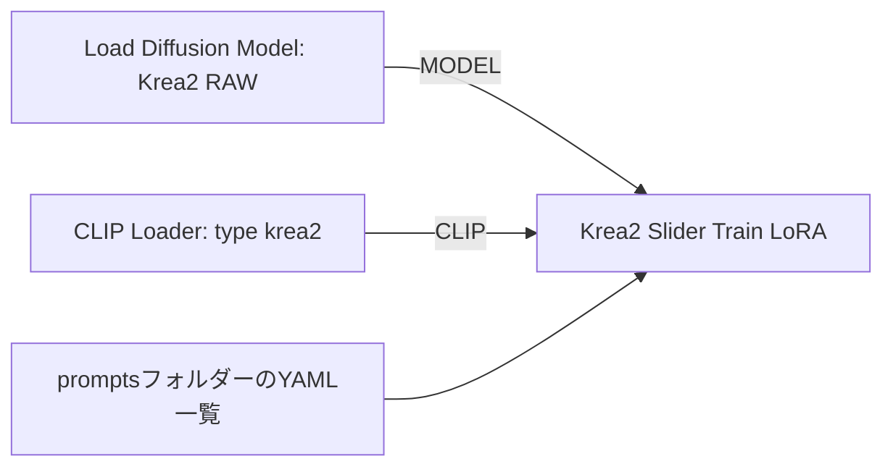

# Krea2 Concept Slider LoRA for ComfyUI

Krea2 RAWを使い、概念を正負の強度で調整するLoRAをComfyUI内で学習するカスタムノードです。ベース重みは凍結し、LoRAだけを更新します。

**実験版です。** AMD ROCmのR9700で実モデルの学習・保存を検証しています。NVIDIA用にも同じPyTorch経路を使いますが、NVIDIA実機、物理16GBカード、RAW→TurboでのSlider画質は未検証です。量子化で読み込めることと、望む概念を分離できることは別に評価してください。

## 機能

- ConvRot INT8 RAWの直接読込、またはBF16/FP16 RAWのCPU量子化。
- INT8は保存形式。演算時に必要なLinearだけを復元し、入力勾配を計算します。Triton・bitsandbytesは不要です。
- 指定した主ブロックの凍結重みをCPUに保持し、forward/backward時に逐次転送します。
- 勾配checkpoint、FP32 LoRA＋AdamW、単方向学習を既定にしています。両方向学習は比較用の選択肢です。
- Krea2用CLIPの条件をCPUにキャッシュし、学習中はencoder/VAEをGPUに常駐させません。
- 標準のComfyUI LoRA Loaderで使用できるsafetensorsと、設定・損失・メモリのJSONレポートを保存します。
- キャンセル対応。学習用モデルは独立して所有し、接続済みの推論MODELを書き換えません。

## 必要な環境とモデル

- Krea2とV3カスタムノードに対応するComfyUI。検証環境はComfyUI 0.37.0です。
- CUDAまたはROCm対応のPyTorch。検証環境はWindows 11、torch 2.12.0+rocm7.14.0、R9700です。
- `torch`、`safetensors`、`einops`、`PyYAML`。通常のComfyUI環境にあるパッケージを使用し、torchを自動更新しません。
- **Krea2 RAW**の拡散モデル。Turboは推論用です。
- Krea2対応のQwen3-VL-4B text encoder。CLIP Loaderのtypeを`krea2`にします。
- 学習そのものにVAEは不要です。生成確認にはQwen-Image VAEが必要です。

対応するINT8形式は、各Linearに`weight`、`weight_scale`、`comfy_quant`を持つComfyUI ConvRot INT8です。GGUF・NF4・任意のINT8・FP8チェックポイントは現在のローダーの対象外です。`bf16_reference`は非量子化の比較用です。

RAWを示すmetadataがないファイルでは、選択したモデルをRAWとして記録します。ファイル名だけでRAW/Turboを自動判定しません。モデル重みは同梱していません。

## 使い方

カスタムノードは **Krea2 Slider Train LoRA**、**Krea2 Native LoRA Hooks Fix**、**Krea2 Region Masks**、**Krea2 Conditioning Debug** の4つです。学習ではモデルとtext encoderをComfyUIのネイティブノードで選択します。

1. **Load Diffusion Model / UNETLoader**でKrea2 RAWを選び、`MODEL`出力を学習ノードの`model`へ接続します。`weight_dtype`は`default`を使用します。
2. **CLIP Loader**でQwen3-VL-4Bを選び、typeを`krea2`にして、`CLIP`出力を学習ノードの`clip`へ接続します。
3. 学習ノードの **prompt_yaml** 一覧からプロンプトを選択します。量子化・CPU退避・VRAM予算・学習設定もこのノード内で指定します。



接続されたMODELの重みをCPUから読み出して専用の学習モデルへ渡します。入力MODELを変更したり、別のモデルファイルを名前から推測して読み直したりしません。初期対応は未加工のRAW loader出力です。LoRAやforwardパッチを適用したMODELは無視せずエラーにします。

[学習ワークフロー](workflows/krea2_slider_train.json)は、2つのネイティブloaderと学習ノードを接続済みです。モデル名は調査環境の実在ファイルに合わせているため、別環境ではRAWとtext encoderを選び直してください。API実行用は[こちら](workflows/krea2_slider_train_api.json)です。旧Model Config／Encode Promptsに分かれたワークフローは今回の接続形式へ置き換えています。

プロンプト例：

```yaml
- target: a portrait of a person
  positive: a portrait of a smiling person
  negative: a portrait of a person with a neutral expression
```

`negative`は減らしたい概念で、通常の生成用negative promptとは役割が異なります。複数レコードを指定すると順番に使用します。任意の`neutral`は教師正規化を`neutral`にした場合に使われ、省略時は`target`です。

`training_direction=single`では、YAMLのpositiveへ向かう方向だけをLoRA強度`+1`で学習します。agingは成人の基準状態から皮膚の加齢へ学習し、別のdeaging YAMLを混ぜる処理はありません。同じtarget／negativeの教師予測は共有します。

詳細設定の`bidirectional`を選ぶと、逆向きの教師を数式で作り、強度`-1`のforward/backwardも追加します。通常は`single`を使用します。単方向で学習したLoRAにも負の強度を設定できますが、逆方向の品質は別途確認が必要です。[計算式と違い](docs/training-direction.md)

加齢・胸サイズ・deagingの[用途別プロンプト](prompts/README.md)を同梱し、`prompt_yaml`から選択できます。追加の`.yaml`／`.yml`もこのリポジトリの`prompts`フォルダーに置きます。通常のYAMLブロック形式・アンカーとJSON互換形式を読み込めます。ファイル内容の変更はキャッシュ識別に反映されます。

出力は`ComfyUI/output/krea2_slider_loras/`です。ComfyUIで出力ディレクトリを変更している場合はその配下になります。フォルダーはLoRA検索対象に登録されます。各実行で固有名を使い、既存LoRAを上書きしません。

学習後は[生成確認テンプレート](workflows/krea2_slider_preview.json)のLoRA Loaderで保存したファイルを選択し、同じseedのまま強度を`-1 / 0 / +1`に変えて比較します。このテンプレートのLoRA選択欄は意図的に空です。初期モデルは手元で確認済みのRAWで、Turboに切り替える場合はTurboの推奨step数・CFGへ変更してください。RAW/Turboそれぞれで効果を確認してください。

## 推論用のLoRA Hooksと領域マスク

**Krea2 Native LoRA Hooks Fix**（`model/krea2 slider`）は、量子化・mixed precisionのKrea2 MODELで標準LoRA Hooksを使うための互換性ノードです。

1. `Load Diffusion Model → Krea2 Native LoRA Hooks Fix → KSampler` とMODELを接続します。
2. `Create Hook LoRA (MO)`でSlider LoRAを選びます。
3. `Cond Pair Set Props`にpositive/negative、対象MASK、Hookを渡します。最初は`strength=1`、`set_cond_area=default`で比較します。
4. その出力を`Cond Pair Set Default Combine`へ渡し、Hookなしの元のpositive/negativeをDEFAULT入力へ接続します。最後のpositive/negativeをKSamplerへ渡します。

2つの領域を使う場合は、各MASKとHookに対応する`Cond Pair Set Props`を作り、`Cond Pair Combine`でまとめてから背景用のDefault条件を追加します。同じSliderを通常のLoRA Loaderで全体にも適用すると、対象外にも効果が残ります。

**Krea2 Region Masks** は元画像なしで2つの矩形MASKを作ります。`width`・`height`を生成サイズに合わせ、矩形内部のドラッグで移動、選択中の四隅でサイズ変更します。`Region 1/2`で選択し、`Reset left / right`で左右半分に戻せます。配置は`regions`に保存され、解像度変更後も比率を保ちます。外部入力から`regions`を接続すると編集UIを停止します。不正なJSONはエラーを表示し、resetで復旧できます。

出力は`mask_1`、`mask_2`、`width`、`height`です。MASKを`Cond Pair Set Props`へ、幅・高さをEmpty Latent系ノードへ接続します。領域番号に性別の意味はなく、人物検出や対象外の最終画素の完全一致を保証するものではありません。

Hook修正は出力patcherとそのcloneに限定しますが、内部モデルは共有します。同じモデルを使う並列サンプリングは未検証です。学習ノードには従来どおり未加工のRAW loader出力を接続します。領域の切替は`MinVram`で再計算するため、速度とメモリ使用量は別途確認してください。

領域生成の診断には[デバッグ用ワークフロー](workflows/krea2_two_person_region_slider_debug.json)を使えます。`Krea2 Conditioning Debug`はSampler直前のマスク範囲・DEFAULT・Hook強度だけをログに記録し、CONDITIONINGをそのまま通します。`Krea2 Native LoRA Hooks Fix`の`debug_logging`を有効にすると、Hook重みの適用・解除と復元件数も記録します。ログはComfyUIの起動コンソールに`[Krea2HookDebug]`で出ます。設定と判定方法は[診断手順](docs/hook-debugging.md)を参照してください。

## 16GB向けの開始設定

| 設定 | 開始値 |
|---|---|
| quantization | `convrot_int8` |
| compute_dtype | `bf16`。対応しないGPUでは`fp16`を個別検証 |
| blocks_to_swap | `16` |
| memory_budget_gib | `14` |
| width / height | `512 / 512` |
| rank / alpha | `8 / 8` |
| target | `attention` |
| training_direction | `single` |
| learning_rate | `0.0001` |
| gradient_checkpointing | ON |
| trajectory_steps | `8` |
| teacher_norm_reference | `none` |

`blocks_to_swap`を増やすほどVRAMを節約できますが、転送時間は増えます。余裕が確認できたら減らせます。全Linear、高rank、1024pxは必要メモリが増えるため別途測定してください。

メモリ予算は学習中だけ適用するPyTorch allocatorの上限です。ドライバー・画面表示・他プロセスを含む物理VRAMの保証ではありません。実行終了・失敗時に元のallocator設定へ戻します。

教師軌道の生成にも時間がかかります。`trajectory_steps=2`は短い動作確認向けで、通常の品質比較では複数timestepを使う設定を検討してください。学習中の画像previewは行いません。

## 検証・開発

```powershell
python -m pytest -q
python -m compileall -q krea2_slider_node nodes.py nodes_native_hooks.py nodes_region_masks.py nodes_diagnostics.py tools
python tools/probe_krea2_environment.py
```

pytestのないComfyUI用Pythonでも、`python -m unittest discover -s tests -v`でコアを検証できます。実環境のV3スキーマと標準LoRA計算の検証：

```powershell
python tools/validate_comfy.py C:/path/to/ComfyUI
```

Hook専用テストは通常のPythonではskipされる場合があるため、ComfyUI用Pythonで別途実行します。引数は`comfy/model_patcher.py`があるComfyUI本体のルートです。

```powershell
& 'C:/ComfyUI/.venv/Scripts/python.exe' -B tools/validate_native_hooks.py C:/path/to/ComfyUI
node --test tests/web/test_region_mask_geometry.mjs
# 既存のPlaywrightとChromeが利用可能な場合のDOM編集UI検証:
node tools/validate_region_masks_ui.mjs C:/path/to/node_modules/@playwright/test
```

専用ランナーは11件の実行とskipなしを確認します。ComfyUI更新後も再実行してください。DOM検証は単独fixtureであり、実ComfyUI画面での拡張ロード・保存復元は別に確認します。

実モデルのメモリ試験（人工のテキスト特徴を使用）：

```powershell
python tools/probe_krea2_train_step.py C:/models/raw_int8.safetensors --steps 100 --resolution 512 --blocks-to-swap 16 --budget-gib 14
```

実プロンプトの学習・保存試験：

```powershell
python tools/run_acceptance.py C:/path/to/ComfyUI C:/models/raw_int8.safetensors C:/models/qwen3vl_4b_bf16.safetensors --steps 3
```

モデルや依存を自動ダウンロードする処理はありません。詳細は[検証記録](docs/validation.md)、[実装計画](.omx/plans/krea2-concept-slider-16gb.md)、[実装進捗](docs/implementation-progress.md)を参照してください。

## 現在の制約

- AMDの実測値は32GBのR9700にソフト上限を設けたものです。実16GBカード／NVIDIA／Linuxでの合格結果はありません。
- 検証用の実チェックポイントは`krea2CatTower_v20Raw_int8.safetensors`です。公式RAWそのものの品質結果ではありません。
- 推論用の高速INT8カーネルを学習へ流用していないため、専用カーネルより遅い可能性があります。
- 標準LoRAのキーと数値は検証していますが、Turboへの転用・概念の分離・強度に対する単調性は別途画像評価が必要です。
- 複数GPU、画像ペア学習、LoKr、QPOLA、FP8/NF4入力、学習の中断再開は対象外です。

モデル実装とConvRotの出典・ライセンスは[THIRD_PARTY_NOTICES.md](THIRD_PARTY_NOTICES.md)に記載しています。
